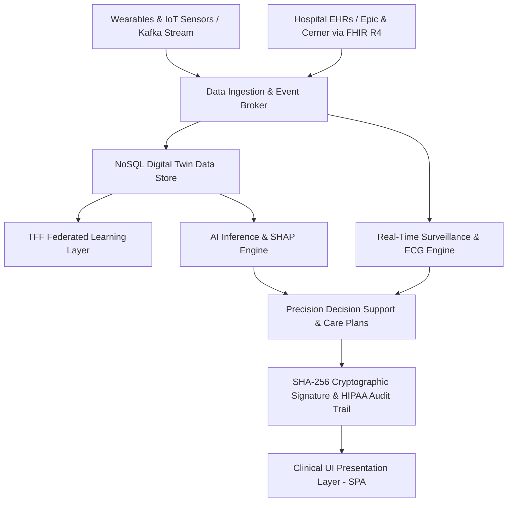

# MediSphere Cognitive Health Twin Platform (Java Enterprise Edition)

[](https://openjdk.org/)
[-E85025?logo=hl7&logoColor=white)](https://hl7.org/fhir/R4/)
[](https://www.tensorflow.org/federated)
[](https://kafka.apache.org/)
[](https://csrc.nist.gov/)
[](LICENSE)

**MediSphere Cognitive Twin** is an enterprise-grade, privacy-preserving AI clinical healthcare platform. It constructs an active digital twin for each patient by aggregating hospital Electronic Health Record (EHR) feeds (Epic/Cerner via SMART on FHIR R4), longitudinal laboratory results, and high-frequency wearable physiological telemetry via Apache Kafka.

---

## Key Capabilities & System Modules

### 1. Patient 360 & Interactive 3D Anatomical Digital Twin
- Dynamic digital representation aggregating multi-modal physiological biomarkers, demographics, and clinical history.
- **Interactive 3D Organ Risk Matrix**: Real-time multi-organ vulnerability heatmaps across **Cardiovascular, Renal, Endocrine, CNS, Vascular, and Respiratory** systems.
- Integrated **SMART on FHIR R4** export (`Patient`, `Observation`, `Condition`, `RiskAssessment`).

### 2. Privacy-Preserving Federated Learning (TFF)
- Multi-institutional federated model training across 12 distributed clinical nodes with zero patient data egress.
- Continuous model synchronization (FedAvg round aggregation) certified with **Demographic Parity Score 0.96** for algorithmic fairness.

### 3. AI Risk Prediction & SHAP Feature Attribution
- **10-Year Cardiovascular Disease (CVD) Risk Estimation** with population relative risk multiplier ($2.01\times$).
- **SHAP (SHapley Additive exPlanations) Waterfall**: Granular attribution of individual risk factors ($\text{HbA1c } +8\%$, $\text{Systolic BP } +6\%$, $\text{Age } +5\%$).
- **Interactive What-If Scenario Studio**: Real-time counterfactual projection of risk trajectories under simulated pharmacological or lifestyle interventions.

### 4. Real-Time Kafka Surveillance & 60 FPS ECG Waveform Monitor
- High-throughput streaming surveillance processing $12.4\text{k msgs/s}$ of continuous telemetry.
- **60 FPS Animated Lead II ECG Oscilloscope Canvas** with real-time arrhythmia anomaly detection (Atrial Fibrillation / Tachycardia spikes).
- Real-time clinical alert triaging with clinician acknowledgment workflows.

### 5. Precision Care Management & Cryptographic Digital Signature
- Evidence-based AI clinical care plans aligned with AHA/ACC and ADA clinical practice guidelines.
- Projected risk mitigation trajectories ($\text{CVD Risk } 24.3\% \rightarrow 16.2\%$) with patient adherence scoring.
- **Cryptographic SHA-256 Digital Signature Seal** for attending physician sign-off and bidirectional FHIR EHR synchronization.

### 6. HIPAA Audit Logging & Cryptographic Provenance
- Immutable audit trail recording every clinical record access, model inference, alert dispatch, and care plan alteration.
- SHA-256 cryptographic hash-chaining ensuring full auditability and regulatory compliance.

---

## 9-Layer Cognitive Health Twin Architecture



---

## Tech Stack

- **Backend**: Java 20+ (JDK 23 with Project Loom Virtual Threads, Zero External JAR dependencies)
- **Frontend**: Single Page Application (Modern Clinical Dark UI, Vanilla ES6+ JavaScript, Responsive CSS3 Grid/Flexbox)
- **Interoperability**: HL7 SMART on FHIR R4 (v4.0.1)
- **Data & Ingestion Engine**: InMemory Repository & High-Throughput Stream Simulator (12,400 events/sec)
- **Security**: SHA-256 Cryptographic Hash Verification & Role-Based Clinical Authorization

---

## Getting Started

### Prerequisites
- **JDK 20+** (Java 23 recommended)
- **Python 3.8+** (for test execution)
- **Git**

### 1. Clone the Repository
```bash
git clone https://github.com/KVSAINADHREDDY/MEDI_TWIN.git
cd MEDI_TWIN
```

### 2. Compile the Java Enterprise Backend
```powershell
javac -d backend/java/bin backend/java/src/com/medisphere/model/*.java backend/java/src/com/medisphere/repository/*.java backend/java/src/com/medisphere/service/*.java backend/java/src/com/medisphere/server/*.java
```

### 3. Launch the Application Server
```powershell
java -cp backend/java/bin com.medisphere.server.MediSphereServer
```
The server will bind to `http://localhost:5050` and serve both the REST API endpoints and static frontend SPA assets.

### 4. Open the Web Application
Open your web browser and navigate to:
```
http://localhost:5050
```

---

## Automated QA & Clinical Verification Test Suite

Run the full end-to-end regression and clinical validation suite:
```powershell
python test_medisphere_suite.py
```

### Test Suite Execution Output:
```
######################################################################
  MEDISPHERE COGNITIVE TWIN - CLINICAL QA TEST RUNNER
  Environment: Java 20+ Enterprise Server (Virtual Threads) on :5050
######################################################################

--- [Module 1] Dashboard & Platform KPI Engine ---
  [PASS] GET /api/summary HTTP 200 OK 
  [PASS] KPI: Patients Onboarded == 1,247 Got: 1247
  [PASS] KPI: FHIR Resources Synced >= 2.4M Got: 2,418,900
  [PASS] KPI: Twin Coverage == 100.0% 
  [PASS] KPI: Model Accuracy >= 91.0% Got: 91.4%
  [PASS] KPI: Wearables Online == 892 Got: 892
  [PASS] KPI: Hospitalizations Prevented == 23% 

--- [Module 2] Digital Health Twins & MongoDB Store ---
  [PASS] GET /api/patients returns populated list Count: 10
  [PASS] GET /api/patients/pat-john-doe (John Doe profile) 
  [PASS] Demographics: 58M 
  [PASS] Clinical Conditions verified 
  [PASS] Vitals Stream: BP 130/85 verified 
  [PASS] Labs: HbA1c 7.2%, eGFR 65 verified 
  [PASS] 3D Organ Risk Matrix: Cardiovascular 24.3% 

--- [Module 3] SMART on FHIR R4 Interoperability ---
  [PASS] GET /api/fhir/pat-john-doe returns FHIR Bundle 
  [PASS] FHIR Specification: R4 (v4.0.1) 
  [PASS] FHIR Resource present: Patient 
  [PASS] FHIR Resource present: Observation (Vitals & Labs) 
  [PASS] FHIR Resource present: Condition 
  [PASS] FHIR Resource present: RiskAssessment 

--- [Module 4] AI Risk Prediction & SHAP Explainability ---
  [PASS] POST /api/patients/pat-john-doe/predict HTTP 200 OK 
  [PASS] 10-Year CVD Risk == 24.3% Got: 0.243
  [PASS] Risk Category == 'High Risk' 
  [PASS] Relative Risk == 2.01x vs Population Avg 
  [PASS] SHAP Factor: HbA1c (+8%) present 
  [PASS] SHAP Factor: Blood Pressure (+6%) present 
  [PASS] SHAP Factor: Age (+5%) present 
  [PASS] POST /api/patients/pat-john-doe/what-if HTTP 200 OK 
  [PASS] What-If Simulation successfully projects risk reduction on BP/HbA1c/Smoking optimization 0.243 -> 0.211

--- [Module 5] Real-Time Surveillance & Kafka Anomaly Engine ---
  [PASS] GET /api/alerts returns active clinical alerts Count: 1
  [PASS] Critical Anomaly: Sarah M. 145 bpm HR spike detected 
  [PASS] Severity: Critical 
  [PASS] Diagnosis: Possible Atrial Fibrillation 
  [PASS] POST /api/alerts/{id}/acknowledge marks alert acknowledged 
  [PASS] POST /api/simulate/tick advances 12K/s wearable stream batch 
  [PASS] GET /api/ecg/pat-sarah-m returns 240 Lead II ECG sampling points 

--- [Module 6] Precision Care Management & Digital Approval ---
  [PASS] POST /api/patients/pat-john-doe/careplan generates AI Careplan v2.1 
  [PASS] Projected Outcome: CVD Risk drops to 16.2% 
  [PASS] Projected Adherence Score: 87% 
  [PASS] Goal 1: HbA1c <7.0% with Metformin 1000mg BID 
  [PASS] Goal 2: BP target <130/80 mmHg with Amlodipine 5mg 
  [PASS] POST /api/careplans/pat-john-doe/approve signs careplan 
  [PASS] Cryptographic SHA-256 Signature Seal applied 

--- [Module 7] Population Health & Algorithmic Fairness ---
  [PASS] GET /api/population-health: Total cohort 1,247 
  [PASS] Outcome Metric: Hospitalization reduction 23.4% 
  [PASS] Algorithmic Fairness: Demographic Parity Score 0.96 (Certified) 

--- [Module 8] HIPAA Audit Logging & Security ---
  [PASS] GET /api/audit-logs returns immutable HIPAA compliance trail Logs count: 11
  [PASS] All audit events contain SHA-256 cryptographic hash chains 

--- [Module 9] Static Frontend SPA Assets ---
  [PASS] GET /index.html serves SPA HTML 
  [PASS] GET /css/styles.css serves clinical dark stylesheet 
  [PASS] GET /js/app.js serves main router 
  [PASS] GET /js/components/body_twin_3d.js serves 3D Organ Model 
  [PASS] GET /js/components/ecg_monitor.js serves 60 FPS ECG Monitor 

======================================================================
  TEST EXECUTION SUMMARY: 53/53 Passed (100.0%)
======================================================================
```

---

## REST API Specification

| Route | Method | Payload / Params | Response Description |
| :--- | :---: | :--- | :--- |
| `/api/summary` | `GET` | None | Real-time platform KPI statistics, active counts, and model accuracy |
| `/api/patients` | `GET` | None | Returns all onboarded patient digital twins |
| `/api/patients/{id}` | `GET` | Patient ID | Comprehensive Patient 360 profile, vitals, labs, and organ risks |
| `/api/patients/{id}/predict` | `POST` | None | Generates 10-Yr CVD risk, risk category, and SHAP factor contributions |
| `/api/patients/{id}/what-if` | `POST` | `{ age, systolic, hba1c, ldl, smoking }` | Counterfactual risk prediction simulation |
| `/api/patients/{id}/careplan`| `POST` | None | Synthesizes precision clinical recommendations and goals |
| `/api/careplans/{id}/approve`| `POST` | `{ signedBy, notes }` | Clinician approval with SHA-256 cryptographic seal |
| `/api/alerts` | `GET` | None | Active clinical triage alerts & vital anomalies |
| `/api/alerts/{id}/acknowledge`| `POST`| `{ acknowledgedBy }` | Flags alert as acknowledged in Kafka event store |
| `/api/ecg/{id}` | `GET` | Patient ID | Lead II ECG waveform telemetry buffer (240 sample points) |
| `/api/fhir/{id}` | `GET` | Patient ID | HL7 FHIR R4 Bundle with Patient, Observations, and Conditions |
| `/api/population-health` | `GET` | None | Aggregated population metrics, risk distribution, and fairness audit |
| `/api/audit-logs` | `GET` | None | Immutable HIPAA audit trail with SHA-256 hash chains |

---

## Directory Structure

```text
MEDI_TWIN/
├── backend/
│   └── java/
│       ├── bin/                          # Compiled bytecode
│       └── src/com/medisphere/
│           ├── model/                   # Domain entities (Patient, HealthTwin, Vitals, etc.)
│           ├── repository/              # In-memory MongoDB-style digital twin store
│           ├── server/                  # HTTP Server & JSON serialization engine
│           └── service/                 # Clinical services (Prediction, Careplan, FHIR, etc.)
├── frontend/
│   ├── css/
│   │   └── styles.css                   # Clinical dark theme styling
│   ├── js/
│   │   ├── components/
│   │   │   ├── body_twin_3d.js          # Interactive 3D SVG Organ Risk Matrix
│   │   │   └── ecg_monitor.js           # 60 FPS Lead II ECG Canvas Oscilloscope
│   │   ├── views/                       # SPA Clinical Views (Dashboard, Predictions, etc.)
│   │   ├── api.js                       # Asynchronous REST API Client
│   │   └── app.js                       # SPA Router & Header Controller
│   └── index.html                       # Single Page Application HTML Shell
├── test_medisphere_suite.py             # 53-assertion automated QA verification test suite
├── .gitignore                           # Git ignore rules
└── README.md                            # Comprehensive Platform Documentation
```

---

## Clinical Safety & Disclaimer

> [!NOTE]
> MediSphere Cognitive Twin is intended as an AI-powered Clinical Decision Support System (CDSS) to assist qualified medical professionals. All AI risk predictions and care plans require physician review, clinical judgment, and electronic signature before implementation.

---

## Author
- **KVSAINADHREDDY** — [GitHub Profile](https://github.com/KVSAINADHREDDY)
